# 1.11 change

- [x] Regarding time, we uniformly designate it as "day - month - year".check grammar

## in the Summer School section

| before                                                       | after                                                        |
| ------------------------------------------------------------ | ------------------------------------------------------------ |
| in series overview                                           |                                                              |
| spear-headed                                                 | spearheaded                                                  |
| the Jilin University                                         | Jilin University                                             |
| during August 24-28                                          | fron 24–28 August                                            |
| 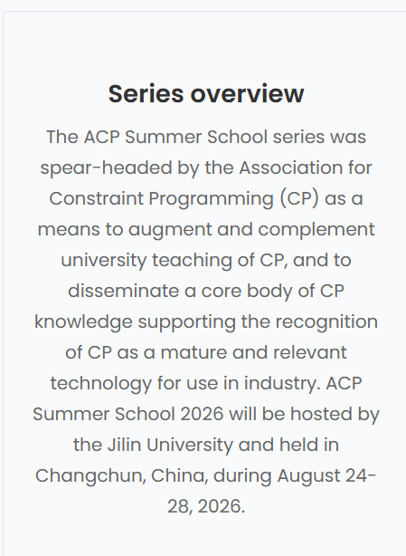 | 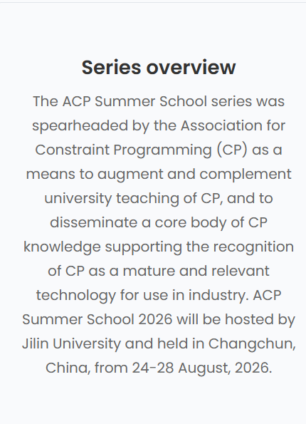 |
| 2026 program                                                 |                                                              |
| will have eight... to provide                                | will feature... providing                                    |
| There will also be Teaching Assistants                       | Teaching Assistants will be available                        |
| 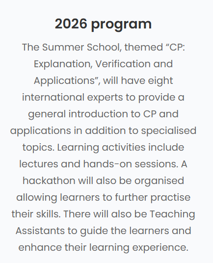 | 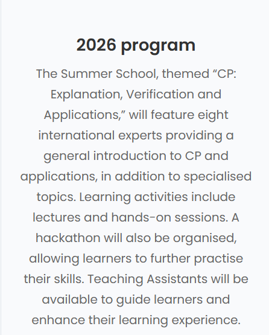 |
| target audience                                              |                                                              |
| PhD and Masters students                                     | PhD and Master’s students                                    |

## in Registration Details section

- [x] Removed "the" before China
- [x] adjust a/an

| before                                                       | after                                                        |
| ------------------------------------------------------------ | ------------------------------------------------------------ |
| entry into the China                                         | entry into China                                             |
| You will receive an confirmation email                       | You will receive a confirmation email                        |
| within 14 days after                                         | within 14 days of                                            |
| You will receive an confirmation email that the registration has been received, which contains all payment details. | You will receive a confirmation email acknowledging that your registration has been received. This email will contain all necessary payment details. |
| 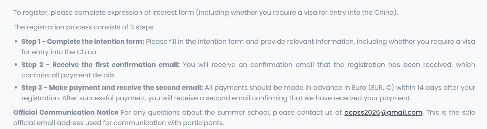 | 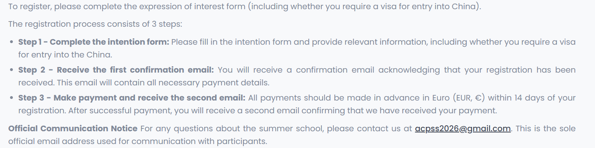 |

- [x] 统一了所有的Summer School
- [x]  Organisers are not liable for damages/losses if the conference is cancelled due to force majeure.→The organizers are not liable for any damages or losses should the conference be canceled due to force majeure.
- [x] China's previous "the" has all been removed.

| before                                                       | after                                                        |
| ------------------------------------------------------------ | ------------------------------------------------------------ |
| 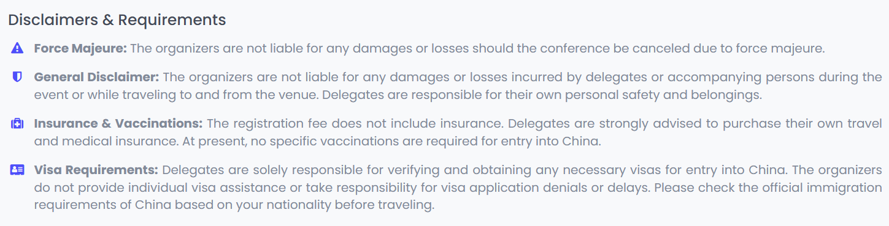 | 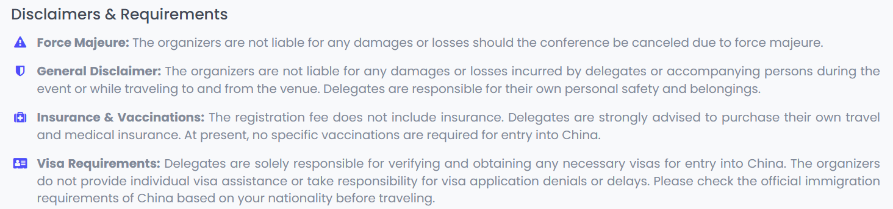 |
| **Taxis**: Extensive routes, some directly reaching scenic spots, with fares CNY 1-2, and seamless transfers to the subway system. | **Taxis**: Taxis are readily available at the airport. The fare to the city center is typically between CNY 80–120, depending on the distance and traffic. |
| **Payment Methods**: WeChat Pay and Alipay are widely accepted everywhere. Visa, Mastercard, and UnionPay are accepted at hotels and most local merchants. | **Payment Methods**: WeChat Pay and Alipay are widely accepted everywhere. Visa, Mastercard, and UnionPay are accepted at hotels and most local merchants.  &#9;**Tip**: You may link an international credit card (e.g., Visa or Mastercard) to a supported payment app before arrival for direct payment via WeChat Pay or Alipay. |

# 1.10 change

- [x] 我们对网站的Name change section进行了修改

| before                                                       | after                                                        |
| ------------------------------------------------------------ | ------------------------------------------------------------ |
| 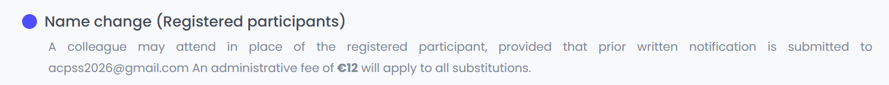 | 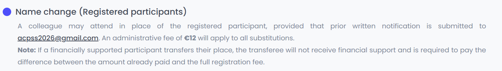 |

- [x] We reduced the frequency of the appearance of the email.

| before                                                       | after                                                        |
| ------------------------------------------------------------ | ------------------------------------------------------------ |
| 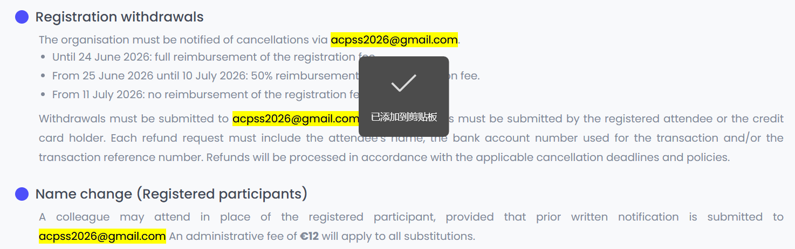 | 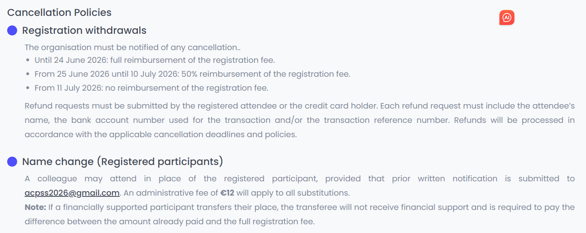 |

# 1.9 change

- [x] We adjusted the line spacing between the paragraphs of the Event Venue section so that the spacing between the paragraphs is greater than the line spacing

| before                                                       | after                                                        |
| ------------------------------------------------------------ | ------------------------------------------------------------ |
| 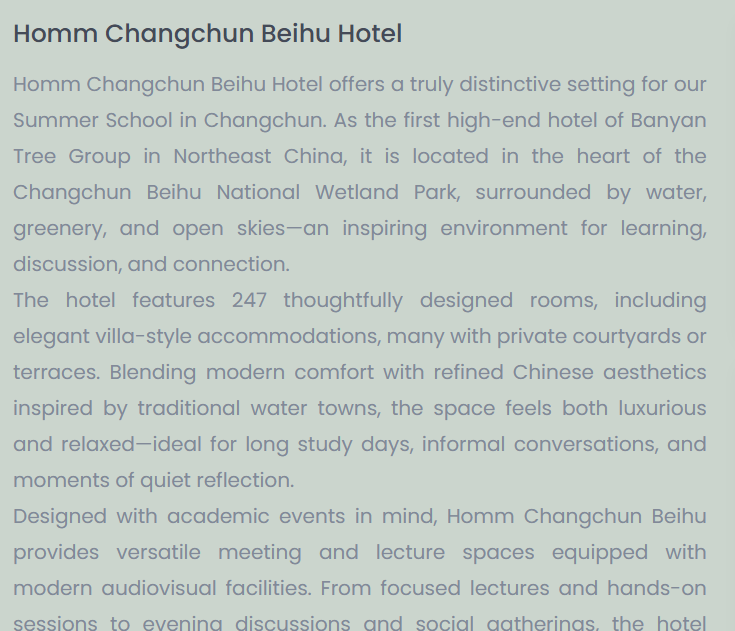 | 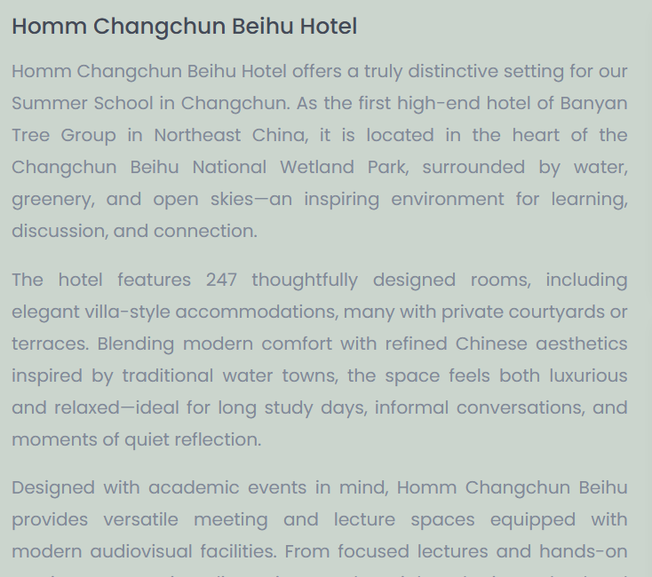 |

- [x] We changed our intention form to expression of interest form

| before                                                       | after                                                        |
| ------------------------------------------------------------ | ------------------------------------------------------------ |
| 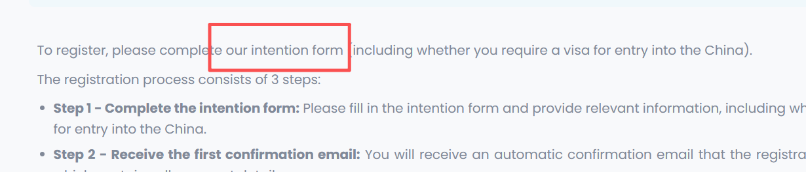 | 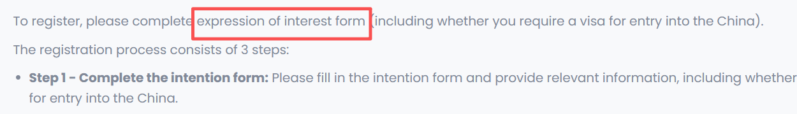 |

- [x] 更新吉林大学符号计算与知识工程教育部重点实验室的logo

| before                                                       | after                                                        |
| ------------------------------------------------------------ | ------------------------------------------------------------ |
| 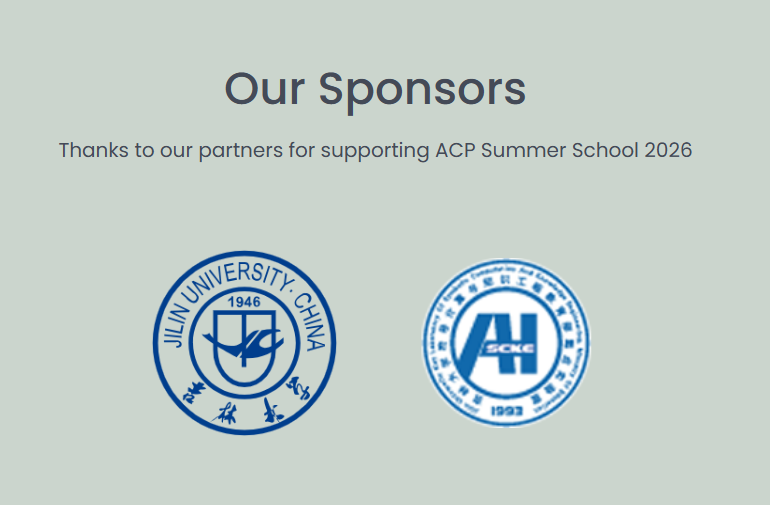 |  |

- [x] 删掉了不必要的facebook的logo

| before                                                       | after                                                        |
| ------------------------------------------------------------ | ------------------------------------------------------------ |
|  |  |

# 1.7 change

- [x] We have removed the "Space for rent" item from the sponsor section. Since there are only two sponsors now, this will cause a loop situation. It might not look good, so we are currently using a static display to show the sponsors. When there are more sponsors, we will switch back to the carousel format.

| before                                                       | after                                                        |
| ------------------------------------------------------------ | ------------------------------------------------------------ |
| 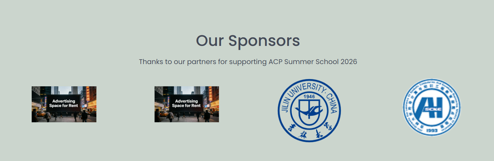 |  |

- [x] I also corrected the mistakes in the "speaker" section.

| before                                                       | after                                                        |
| ------------------------------------------------------------ | ------------------------------------------------------------ |
| Cieran McCreesh                                              | Ciaran McCreesh                                              |
| 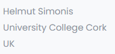 |  |

# 12.24 change

我们针对细节问题进行了修改

- [x] Make adjustments to the Financial Supports section

| before                                                       | after                                                        |
| ------------------------------------------------------------ | ------------------------------------------------------------ |
| 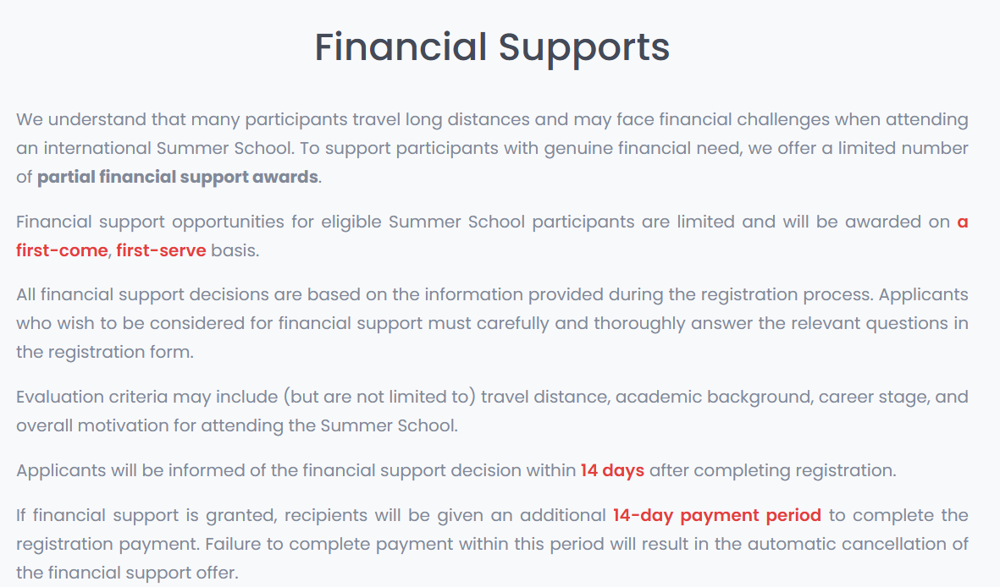 |  |

- [x] Registration Cancellation→Registration Withdrawals

| before                                                       | after                                                        |
| ------------------------------------------------------------ | ------------------------------------------------------------ |
| Cancellations will be accepted in writing only ([acpss2026@gmail.com](mailto:acpss2026@gmail.com)) and must be received by the stated cancellation deadline. All refund requests must be made by the attendee or credit card holder. Refund requests must include the name of the attendee, the bank account number used during the transaction and/or the transaction number. | Withdrawals must be submitted to acpss2026@gmail.com. Refund requests must be submitted by the registered attendee or the credit card holder. Each refund request must include the attendee’s name, the bank account number used for the transaction and/or the transaction reference number. Refunds will be processed in accordance with the applicable cancellation deadlines and policies. |

- [x] Name change

| before                                                       | after                                                        |
| ------------------------------------------------------------ | ------------------------------------------------------------ |
| Colleagues may attend in your place with prior written notification to [acpss2026@gmail.com](mailto:acpss2026@gmail.com). An administrative fee will apply. Any subsequent changes to the substitution request will incur an additional charge (€ 12) . | A colleague may attend in place of the registered participant, provided that prior written notification is submitted to acpss2026@gmail.com An administrative fee of **€12** will apply to all substitutions. |

# 12.19 change

- [x] We have made the transparency of the cover image brighter

| before                                                       | after                                                        |
| ------------------------------------------------------------ | ------------------------------------------------------------ |
| 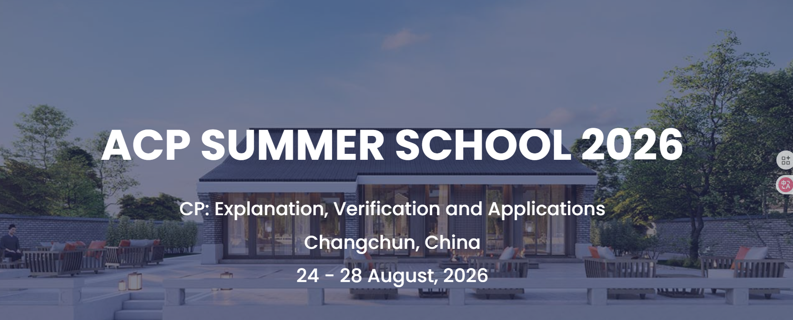 |  |

- [x] To highlight the hotel's features, we have revised the hotel's introduction.From "simple hotel promotion" to "highlighting the suitability for summer schools", it adds descriptions of academic conference facilities and the atmosphere combining learning and nature, precisely hitting the demand of the target users (international participants) for "learning scenarios + comfort level"

| before                                                       | after                                                        |
| ------------------------------------------------------------ | ------------------------------------------------------------ |
| As Banyan Tree Group’s first high-end hotel in Northeast China, Homm Changchun Beihu Hotel opened on 24 December, 2024. Nestled in the national 4A-level Changchun Beihu National Wetland Park, it features 32 independent villas spanning ~170,000㎡, blending Jiangnan water town charm with new Chinese style. | Homm Changchun Beihu Hotel offers a truly distinctive setting for our Summer School in Changchun. As the first high-end hotel of Banyan Tree Group in Northeast China, it is located in the heart of the Changchun Beihu National Wetland Park, surrounded by water, greenery, and open skies—an inspiring environment for learning, discussion, and connection. |
| The hotel offers 247 themed landscape villa rooms (some with private courtyards/terraces), diverse restaurants, indoor-outdoor hot springs (including the unique "iron pot stew hot spring pool"), parent-child facilities, and a 1,720㎡ independent conference building. | The hotel features 247 thoughtfully designed rooms, including elegant villa-style accommodations, many with private courtyards or terraces. Blending modern comfort with refined Chinese aesthetics inspired by traditional water towns, the space feels both luxurious and relaxed—ideal for long study days, informal conversations, and moments of quiet reflection. |
| Unique experiences include boat check-in (summer) and horse-drawn sleigh check-in (winter), plus the winter-only "Homm Ice Park" with ice camping and snowmobiling. Shuttle bus service is available for easy access. | Designed with academic events in mind, Homm Changchun Beihu provides versatile meeting and lecture spaces equipped with modern audiovisual facilities. From focused lectures and hands-on sessions to evening discussions and social gatherings, the hotel comfortably supports the full rhythm of a Summer School. |
|                                                              | Beyond the classrooms, participants can enjoy diverse dining options and step directly into the surrounding wetland park for a walk, a conversation, or a break between sessions. With accommodation, learning spaces, and nature seamlessly connected, Homm Changchun Beihu Hotel creates an atmosphere where intensive study and meaningful exchange feel both productive and enjoyable. |

- [x] Do not use Chinese for "sponsor". We have replaced the image of "sponsor".

| before                                                       | after                                                        |
| ------------------------------------------------------------ | ------------------------------------------------------------ |
|  |  |

- [x] Financial support is substantial. It is clearly stated as "partral", based on the questions answered during registration, and a decision will be made within 14 days. "Serve" does not have "d". These two words should be in red font and given a title. We understand that many people are coming, and we appreciate everyone's efforts. Therefore, we will provide financial assistance. Those in need should provide detailed answers during registration. We will make a decision based on the answers (distance, academic background, etc.) within 14 days, and there will be an additional 14-day period for decision payment. If the payment is not made, the scholarship will be cancelled.And the format has been adjusted, with both ends aligned.

| before                                                       | after                                                        |
| ------------------------------------------------------------ | ------------------------------------------------------------ |
| 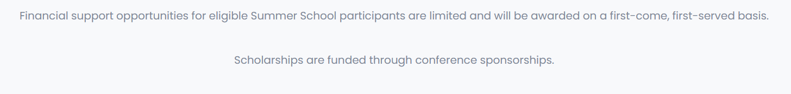 |  |

- [x] Registration Fee Include---Includes
- [x] We replaced all the "host country" references with "China".
- [x] position control，We have revised the unordered list under "Accommodation" and "Local Transportation"

|                                                              |                                                              |
| ------------------------------------------------------------ | ------------------------------------------------------------ |
| 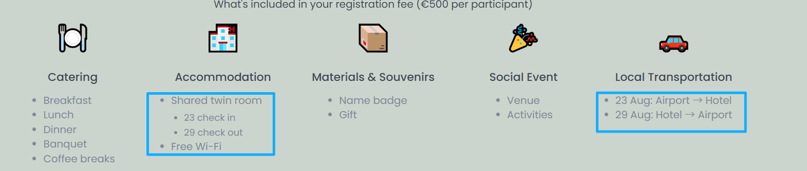 | 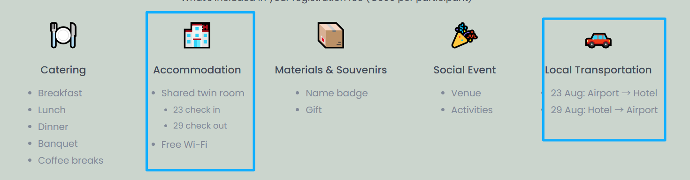 |

- [x] We have also made adaptations for mobile devices.
- [x] We have added a carousel style to the hotel, with the images changing automatically every 2.5 seconds.

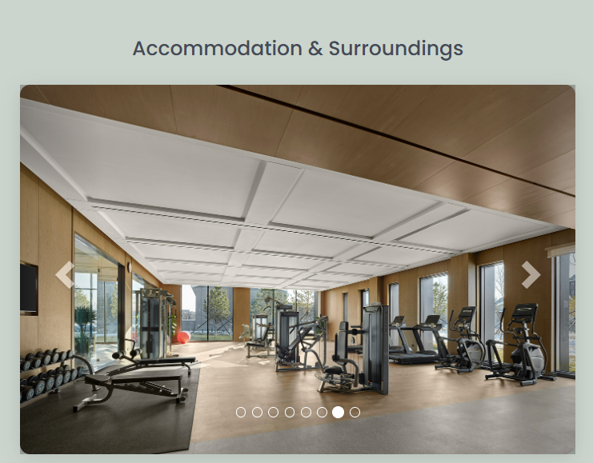

