# 1.11 change

- [x] Adjusted the sizes of the three boxes to make them all the same size.

| before                                                       | after                                                        |
| ------------------------------------------------------------ | ------------------------------------------------------------ |
| 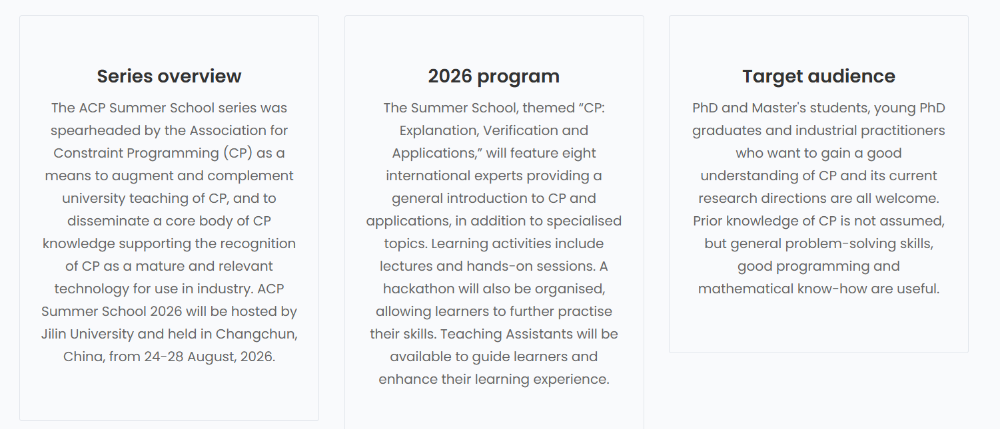 | 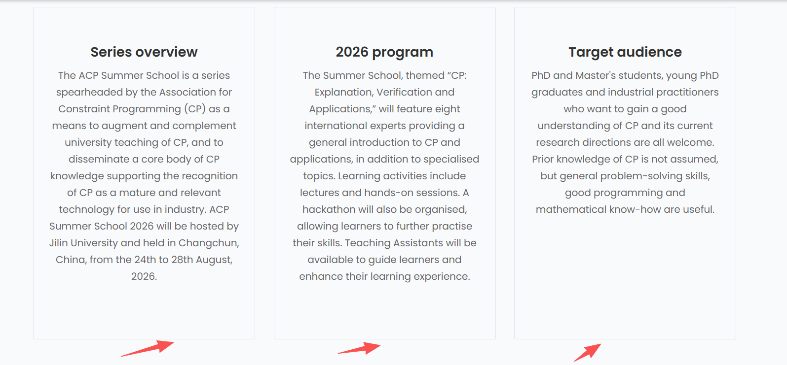 |

- [x] The name should be larger than other information

| before                                                       | after                                                        |
| ------------------------------------------------------------ | ------------------------------------------------------------ |
|  |  |

- [x] Under "View Detail", you can add an underline or something similar to make it clear that this is a button.

| before                                                       | after                                                        |
| ------------------------------------------------------------ | ------------------------------------------------------------ |
|  |  |

- [x] The words "day", "month", "year", "month", "year" are not separated by commas.

| before                                                       | after                                                        |
| ------------------------------------------------------------ | ------------------------------------------------------------ |
| 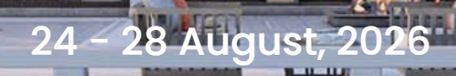 | 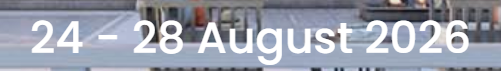               |
| 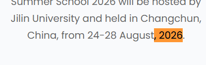 | 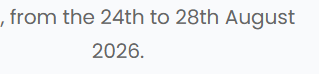 |
|  |  |

- [x] Content adjustment

| before                                                       | after                                                        |
| ------------------------------------------------------------ | ------------------------------------------------------------ |
| series overview                                              |                                                              |
| The ACP Summer School series was spearheaded by the Association for Constraint Programming (CP) as a means to augment and complement university teaching of CP, and to disseminate a core body of CP knowledge supporting the recognition of CP as a mature and relevant technology for use in industry. ACP Summer School 2026 will be hosted by Jilin University and held in Changchun, China, from 24-28 August, 2026. | The ACP Summer School is a series spearheaded by the Association for Constraint Programming (CP) as a means to augment and complement university teaching of CP, and to disseminate a core body of CP knowledge supporting the recognition of CP as a mature and relevant technology for use in industry. ACP Summer School 2026 will be hosted by Jilin University and held in Changchun, China, from the 24th to 28th August, 2026. |
| Event Venue                                                  |                                                              |
| Homm Changchun Beihu Hotel offers a truly distinctive setting for our Summer School in Changchun. As the first high-end hotel of Banyan Tree Group in Northeast China, it is located in the heart of the Changchun Beihu National Wetland Park, surrounded by water, greenery, and open skies—an inspiring environment for learning, discussion, and connection. The hotel features 247 thoughtfully designed rooms, including elegant villa-style accommodations, many with private courtyards or terraces. Blending modern comfort with refined Chinese aesthetics inspired by traditional water towns, the space feels both luxurious and relaxed—ideal for long study days, informal conversations, and moments of quiet reflection. Designed with academic events in mind, Homm Changchun Beihu provides versatile meeting and lecture spaces equipped with modern audiovisual facilities. From focused lectures and hands-on sessions to evening discussions and social gatherings, the hotel comfortably supports the full rhythm of a Summer School. Beyond the classrooms, participants can enjoy diverse dining options and step directly into the surrounding wetland park for a walk, a conversation, or a break between sessions. With accommodation, learning spaces, and nature seamlessly connected, Homm Changchun Beihu Hotel creates an atmosphere where intensive study and meaningful exchange feel both productive and enjoyable. | This year’s Summer School will take place at the Homm Changchun Beihu Hotel, located within the Changchun Beihu National Wetland Park. Set amid water, greenery, and open skies, the venue offers a calm and spacious environment that supports focused learning, in-depth discussion, and sustained intellectual engagement. The hotel provides comfortable on-site accommodation together with a range of modern lecture halls and meeting rooms equipped with professional audiovisual facilities. Partipants may move between living spaces, classrooms, and informal discussion areas, encouraging both structured learning and spontaneous academic exchange. Beyond the classrooms, participants may step directly into the surrounding park for a short walk, a conversation, or a moment of reflection between sessions. |
| Delegates are solely responsible for verifying and obtaining any necessary visas for entry into China. The organizers do not provide individual visa assistance or take responsibility for visa application denials or delays. Please check the official immigration requirements of China based on your nationality before traveling. | Delegates are solely responsible for obtaining any necessary visas for entry into China. The organizers do not provide individual visa assistance or take responsibility for visa application denials or delays. Please check the official immigration requirements of China based on your nationality before traveling. |
| In August, Changchun’s average daily temperature ranges from 19°C to 28°C, with a day–night difference of about 8–10°C. Days are generally mild, while nights can feel slightly cool, so bringing a light jacket is recommended. Participants are also advised to bring an umbrella depending on the weather. Air quality is consistently excellent, making it well suited for outdoor activities. | In August, Changchun’s average daily temperature ranges from 19°C to 28°C, with a day–night difference of about 10°C. We recommend participants to bring a light jacket as well as an umbrella in case of wet weather. |
| We provide shuttle service between Changchun Longjia International Airport and the venue will be available for all participants. Detailed pick-up times and meeting points will be announced in advance. | We provide a shuttle service between Changchun Longjia International Airport. Detailed pick-up times and meeting points will be announced in advance. |
| Routes 1–3 operate between major city hubs and the airport; fare CNY 25 per person. | Routes 1–3 operate between major city hubs and the airport; fares are CNY 25 per person. |
| A network of six lines connects major districts and attractions, operating from 05:15 to 22:35, with fares of CNY 2–4. | A network of six lines connects major districts and attractions, operating from 05:15 to 22:35, with fares ranging CNY 2–4. |
| WeChat Pay and Alipay are widely accepted everywhere. Visa, Mastercard, and UnionPay are accepted at hotels and most local merchants. You may link an international credit card (e.g., Visa or Mastercard) to a supported payment app before arrival for direct payment via WeChat Pay or Alipay. | WeChat Pay and Alipay are widely accepted and are preferred payment methods. Visa, Mastercard, and UnionPay are accepted at hotels and most local merchants. For easy payment, we recommend that you link an international credit card (e.g., Visa or Mastercard) to WeChat Pay or Alipay before arrival. |
| **Foreign Currency Exchange**:You can obtain some cash at Changchun Longjia International Airport. Cash withdrawals using Visa, Mastercard, and UnionPay cards are available at the airport, and currency exchange services are provided at more than 520 bank branches across Changchun. | **Cash Withdrawals and Currency Exchange**：You may withdraw cash at Changchun Longjia International Airport. Currency exchange services are available at more than 500 locations across Changchun. |
| ATMs at the airport and in major business districts allow cash withdrawals with Visa, Mastercard, and UnionPay cards. Usually offer English interfaces, and withdrawals are processed at real-time exchange rates, with fees set by the issuing bank. | You may use ATMs at the airport or in major business districts to make cash withdrawals with Visa, Mastercard, and UnionPay cards. ATMs generally support English interfaces, and withdrawals are processed at real-time exchange rates, with fees set by the issuing bank. |
| During breaks from schoolwork, you can come here for a walk and enjoy happy moments. | Come here for a walk during breaks.                          |

- [x] The "Financial Support" section has been widened to be consistent with the others.

| before                                                       | after                                                        |
| ------------------------------------------------------------ | ------------------------------------------------------------ |
| 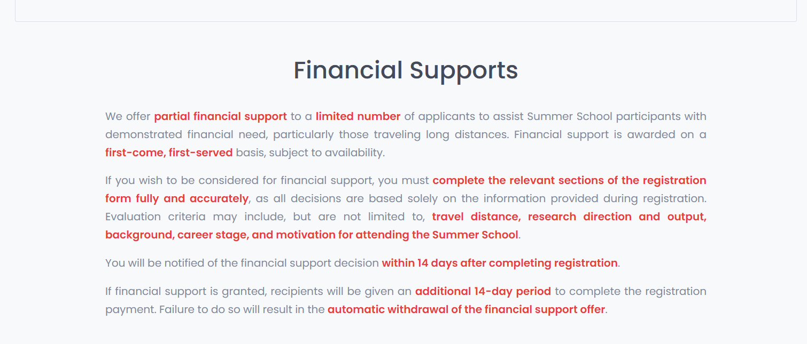 | 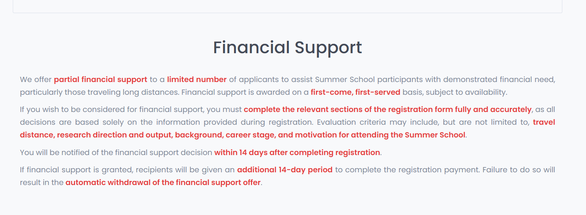 |

- [x] Name change (Registered participants) -> Registration transfer

| before                                                       | after                                                        |
| ------------------------------------------------------------ | ------------------------------------------------------------ |
|  | 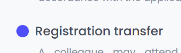 |

- [x] How to get to China (Changchun) -> Travelling to Changchun, China

| before                                                       | after                                                        |
| ------------------------------------------------------------ | ------------------------------------------------------------ |
| 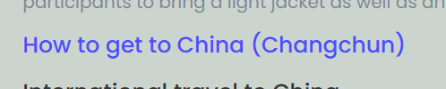 | 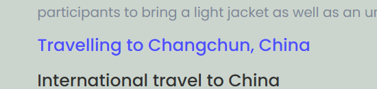 |

- [x]  ¥→CNY

| before                                                       | after                                                        |
| ------------------------------------------------------------ | ------------------------------------------------------------ |
| 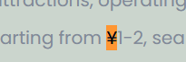 | 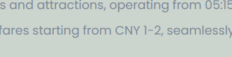 |

- [ ] 1

# 1.10 change

- [x] 我们对网站的Name change section进行了修改

| before                                                       | after                                                        |
| ------------------------------------------------------------ | ------------------------------------------------------------ |
|  |  |

- [x] We reduced the frequency of the appearance of the email.

| before                                                       | after                                                        |
| ------------------------------------------------------------ | ------------------------------------------------------------ |
|  |  |

# 1.9 change

- [x] We adjusted the line spacing between the paragraphs of the Event Venue section so that the spacing between the paragraphs is greater than the line spacing

| before                                                       | after                                                        |
| ------------------------------------------------------------ | ------------------------------------------------------------ |
|  |  |

- [x] We changed our intention form to expression of interest form

| before                                                       | after                                                        |
| ------------------------------------------------------------ | ------------------------------------------------------------ |
|  |  |

- [x] 更新吉林大学符号计算与知识工程教育部重点实验室的logo

| before                                                       | after                                                        |
| ------------------------------------------------------------ | ------------------------------------------------------------ |
|  |  |

- [x] 删掉了不必要的facebook的logo

| before                                                       | after                                                        |
| ------------------------------------------------------------ | ------------------------------------------------------------ |
|  |  |

# 1.7 change

- [x] We have removed the "Space for rent" item from the sponsor section. Since there are only two sponsors now, this will cause a loop situation. It might not look good, so we are currently using a static display to show the sponsors. When there are more sponsors, we will switch back to the carousel format.

| before                                                       | after                                                        |
| ------------------------------------------------------------ | ------------------------------------------------------------ |
|  |  |

- [x] I also corrected the mistakes in the "speaker" section.

| before                                                       | after                                                        |
| ------------------------------------------------------------ | ------------------------------------------------------------ |
| Cieran McCreesh                                              | Ciaran McCreesh                                              |
|  |  |

# 12.24 change

我们针对细节问题进行了修改

- [x] Make adjustments to the Financial Supports section

| before                                                       | after                                                        |
| ------------------------------------------------------------ | ------------------------------------------------------------ |
|  |  |

- [x] Registration Cancellation→Registration Withdrawals

| before                                                       | after                                                        |
| ------------------------------------------------------------ | ------------------------------------------------------------ |
| Cancellations will be accepted in writing only ([acpss2026@gmail.com](mailto:acpss2026@gmail.com)) and must be received by the stated cancellation deadline. All refund requests must be made by the attendee or credit card holder. Refund requests must include the name of the attendee, the bank account number used during the transaction and/or the transaction number. | Withdrawals must be submitted to acpss2026@gmail.com. Refund requests must be submitted by the registered attendee or the credit card holder. Each refund request must include the attendee’s name, the bank account number used for the transaction and/or the transaction reference number. Refunds will be processed in accordance with the applicable cancellation deadlines and policies. |

- [x] Name change

| before                                                       | after                                                        |
| ------------------------------------------------------------ | ------------------------------------------------------------ |
| Colleagues may attend in your place with prior written notification to [acpss2026@gmail.com](mailto:acpss2026@gmail.com). An administrative fee will apply. Any subsequent changes to the substitution request will incur an additional charge (€ 12) . | A colleague may attend in place of the registered participant, provided that prior written notification is submitted to acpss2026@gmail.com An administrative fee of **€12** will apply to all substitutions. |

# 12.19 change

- [x] We have made the transparency of the cover image brighter

| before                                                       | after                                                        |
| ------------------------------------------------------------ | ------------------------------------------------------------ |
|  |  |

- [x] To highlight the hotel's features, we have revised the hotel's introduction.From "simple hotel promotion" to "highlighting the suitability for summer schools", it adds descriptions of academic conference facilities and the atmosphere combining learning and nature, precisely hitting the demand of the target users (international participants) for "learning scenarios + comfort level"

| before                                                       | after                                                        |
| ------------------------------------------------------------ | ------------------------------------------------------------ |
| As Banyan Tree Group’s first high-end hotel in Northeast China, Homm Changchun Beihu Hotel opened on 24 December, 2024. Nestled in the national 4A-level Changchun Beihu National Wetland Park, it features 32 independent villas spanning ~170,000㎡, blending Jiangnan water town charm with new Chinese style. | Homm Changchun Beihu Hotel offers a truly distinctive setting for our Summer School in Changchun. As the first high-end hotel of Banyan Tree Group in Northeast China, it is located in the heart of the Changchun Beihu National Wetland Park, surrounded by water, greenery, and open skies—an inspiring environment for learning, discussion, and connection. |
| The hotel offers 247 themed landscape villa rooms (some with private courtyards/terraces), diverse restaurants, indoor-outdoor hot springs (including the unique "iron pot stew hot spring pool"), parent-child facilities, and a 1,720㎡ independent conference building. | The hotel features 247 thoughtfully designed rooms, including elegant villa-style accommodations, many with private courtyards or terraces. Blending modern comfort with refined Chinese aesthetics inspired by traditional water towns, the space feels both luxurious and relaxed—ideal for long study days, informal conversations, and moments of quiet reflection. |
| Unique experiences include boat check-in (summer) and horse-drawn sleigh check-in (winter), plus the winter-only "Homm Ice Park" with ice camping and snowmobiling. Shuttle bus service is available for easy access. | Designed with academic events in mind, Homm Changchun Beihu provides versatile meeting and lecture spaces equipped with modern audiovisual facilities. From focused lectures and hands-on sessions to evening discussions and social gatherings, the hotel comfortably supports the full rhythm of a Summer School. |
|                                                              | Beyond the classrooms, participants can enjoy diverse dining options and step directly into the surrounding wetland park for a walk, a conversation, or a break between sessions. With accommodation, learning spaces, and nature seamlessly connected, Homm Changchun Beihu Hotel creates an atmosphere where intensive study and meaningful exchange feel both productive and enjoyable. |

- [x] Do not use Chinese for "sponsor". We have replaced the image of "sponsor".

| before                                                       | after                                                        |
| ------------------------------------------------------------ | ------------------------------------------------------------ |
|  |  |

- [x] Financial support is substantial. It is clearly stated as "partral", based on the questions answered during registration, and a decision will be made within 14 days. "Serve" does not have "d". These two words should be in red font and given a title. We understand that many people are coming, and we appreciate everyone's efforts. Therefore, we will provide financial assistance. Those in need should provide detailed answers during registration. We will make a decision based on the answers (distance, academic background, etc.) within 14 days, and there will be an additional 14-day period for decision payment. If the payment is not made, the scholarship will be cancelled.And the format has been adjusted, with both ends aligned.

| before                                                       | after                                                        |
| ------------------------------------------------------------ | ------------------------------------------------------------ |
|  |  |

- [x] Registration Fee Include---Includes
- [x] We replaced all the "host country" references with "China".
- [x] position control，We have revised the unordered list under "Accommodation" and "Local Transportation"

|                                                              |                                                              |
| ------------------------------------------------------------ | ------------------------------------------------------------ |
|  |  |

- [x] We have also made adaptations for mobile devices.
- [x] We have added a carousel style to the hotel, with the images changing automatically every 2.5 seconds.

